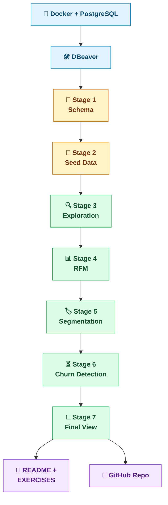
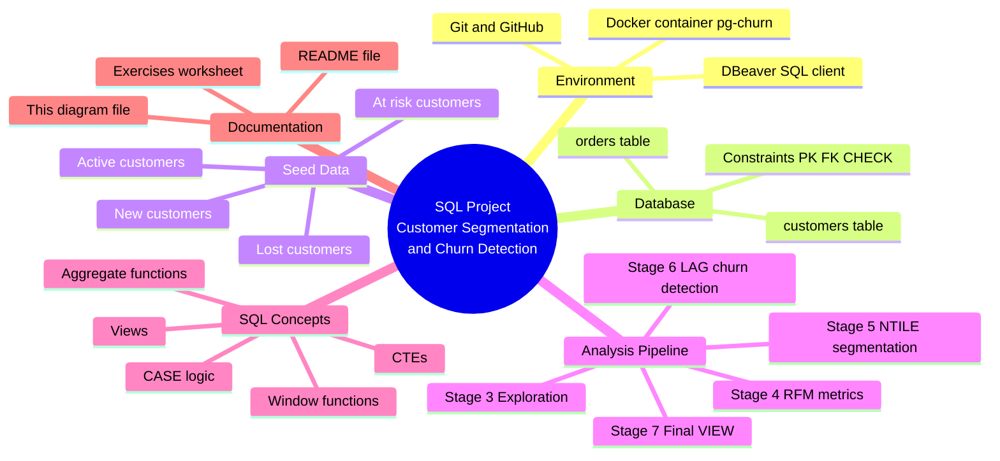

# 🧠 Project Mind Map - Customer Segmentation & Churn Detection

A one-page overview of how everything in this project connects, from the environment it runs in down to the SQL concepts each stage teaches.

## Mermaid Flowchart



##  Mermaid Mindmap



## Text version (ASCII tree)

```
Customer Segmentation & Churn Detection (SQL Project)
│
├── 🐳 Environment
│   ├── Docker (PostgreSQL container: pg-churn)
│   ├── DBeaver (SQL client)
│   └── Git + GitHub (private repo, English commits)
│
├── 🗄️ Database (customers / orders)
│   ├── Stage 1 - Schema
│   │   ├── customers (id, name, email, signup_date)
│   │   └── orders (id, customer_id → FK, order_date, amount CHECK > 0)
│   │
│   └── Stage 2 - Seed Data
│       ├── generate_series + CROSS JOIN (no manual INSERTs)
│       └── 4 behavioural groups
│           ├── Active (ids 1-5) → frequent, recent orders
│           ├── At risk (ids 6-10) → used to order, went quiet ~70 days
│           ├── Lost (ids 11-15) → silent for 180+ days
│           └── New (ids 16-20) → recent signup, few orders
│
├── 🔍 Analysis Pipeline
│   ├── Stage 3 - Exploration
│   │   ├── Total volume & revenue
│   │   ├── Revenue per customer (LEFT JOIN)
│   │   └── Days since last order
│   │
│   ├── Stage 4 - RFM
│   │   ├── Recency → CURRENT_DATE - MAX(order_date)
│   │   ├── Frequency → COUNT(orders)
│   │   └── Monetary → SUM(amount)
│   │
│   ├── Stage 5 - Segmentation
│   │   ├── NTILE(5) scores each of R, F, M (1 = worst, 5 = best)
│   │   └── CASE combines scores → Champion / Loyal / At risk / Lost / New
│   │
│   ├── Stage 6 - Churn Detection
│   │   ├── LAG + PARTITION BY → each customer's average order cycle
│   │   └── overdue_ratio → Active / At risk / Likely churned
│   │
│   └── Stage 7 - Final View
│       └── vw_customer_rfm_churn (CREATE OR REPLACE VIEW)
│           combines Stages 4-6 into one queryable object
│
├── 🧩 SQL Concepts Practiced
│   ├── Constraints → PRIMARY KEY, FOREIGN KEY, CHECK, NOT NULL
│   ├── CTEs → WITH ... AS (...)
│   ├── Window functions → NTILE, LAG
│   ├── Aggregate functions → COUNT, SUM, AVG, MIN, MAX
│   ├── Business logic → CASE WHEN ... THEN ... ELSE ... END
│   └── Reusability → VIEW
│
└── 📄 Documentation
    ├── README.md → overview, setup, SQL glossary, skills demonstrated
    ├── EXERCISES.md → guided worksheet, one challenge + solution per stage
    ├── MINDMAP.md → this file
    └── 01-07 *.sql → one fully-commented script per stage
```

**How to read it:** each stage builds directly on the one before it - Stage 5 reuses the RFM numbers from Stage 4, Stage 7 reuses the logic from Stages 4, 5 *and* 6. Nothing is duplicated by accident; every later CTE exists because an earlier stage already proved the underlying query works.